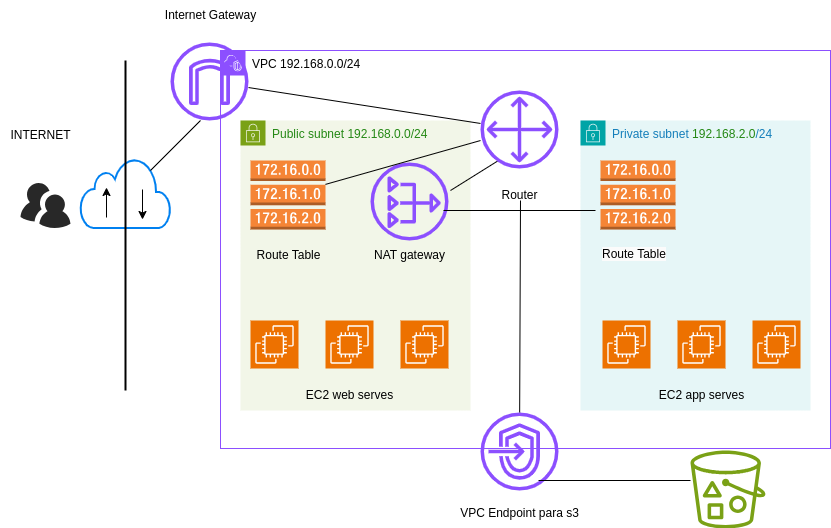

## Descripción 

Este módulo Terraform define una infraestructura de red en AWS que incluye: 

- Una VPC (Virtual Private Cloud) con subredes públicas y privadas. 
- Dos instancias EC2, una pública y otra privada. 
- Un volumen EBS cifrado adjunto a la instancia EC2 pública. 
- Un punto final de VPC para S3. 
- Un Bucket de S3. 
- Un sistema de archivos EFS. 
- Una política de Data Lifecycle Manager (DLM) para tomar instantáneas automáticas de las instancias EC2. 

## Requisitos previos 
- Tener una cuenta de AWS configurada con acceso a la Consola de AWS y la CLI de AWS. 
- Tener un archivo de clave SSH para acceder a las instancias EC2. 

## Variables 

- `var.name`: Nombre de la VPC y otros recursos. 
- `var.cidr`: Bloque CIDR para la VPC. 
- `var.azs`: Lista de zonas de disponibilidad para la VPC. 
- `var.public_subnets`: Número de subredes públicas. 
- `var.public_subnets_name`: Sufijo para los nombres de las subredes públicas. 
- `var.private_subnets`: Número de subredes privadas. 
- `var.private_subnets_name`: Sufijo para los nombres de las subredes privadas. 
- `var.ec2_ami`: AMI de la instancia EC2. 
- `var.instance_type`: Tipo de instancia EC2. 
- `var.key_name`: Nombre del archivo de clave SSH. 
- `var.route_table`: Nombre de la tabla de rutas para la VPC. 
- `var.enable_nat_gateway`: Habilitar o no la puerta de enlace NAT. 
- `var.enable_vpn_gateway`: Habilitar o no la puerta de enlace VPN. 
- `var.inbound_acl_rules`: Reglas de ACL de entrada a la VPC. 
- `var.outbound_acl_rules`: Reglas de ACL de salida para la VPC. 
- `var.security_group_name`: Nombre del grupo de seguridad para las instancias EC2. 
- `var.security_group_rules_ingress`: Reglas de entrada para el grupo de seguridad. 
- `var.security_group_rules_egress`: Reglas de salida para el grupo de seguridad. 
- `var.public_inbound_acl_rules`: Reglas de ACL de entrada a la subred pública. 
- `var.public_outbound_acl_rules`: Reglas de ACL de salida para la subred pública. 
- `var.private_inbound_acl_rules`: Reglas de ACL de entrada a la subred privada. 
- `var.private_outbound_acl_rules`: Reglas de ACL de salida para la subred privada. 
- `var.internet_gateway`: Nombre de la puerta de enlace de Internet. 
- `var.network_acl`: Nombre de la ACL de red predeterminada. 

## Instrucciones de uso 
1. Clonar este repositorio o descargar el código. 
2. Crear un archivo `terraform.tfvars` con las variables definidas. 
3. Inicializar Terraform y ejecutar la configuración: ```sh terraform init terraform plan terraform apply ``` Usa el código con precaución. 

## Notas 
- Este código es solo un ejemplo y puede necesitar ajustes para adaptarse a sus necesidades específicas. 
- Asegúrese de revisar los comentarios en el código para obtener más información sobre cada recurso. 
- Consulte la documentación de Terraform para obtener más información sobre la sintaxis y las opciones de configuración. ## Recursos adicionales 
- [Documentación de Terraform](https://developer.hashicorp.(com/terraform/tutorials)